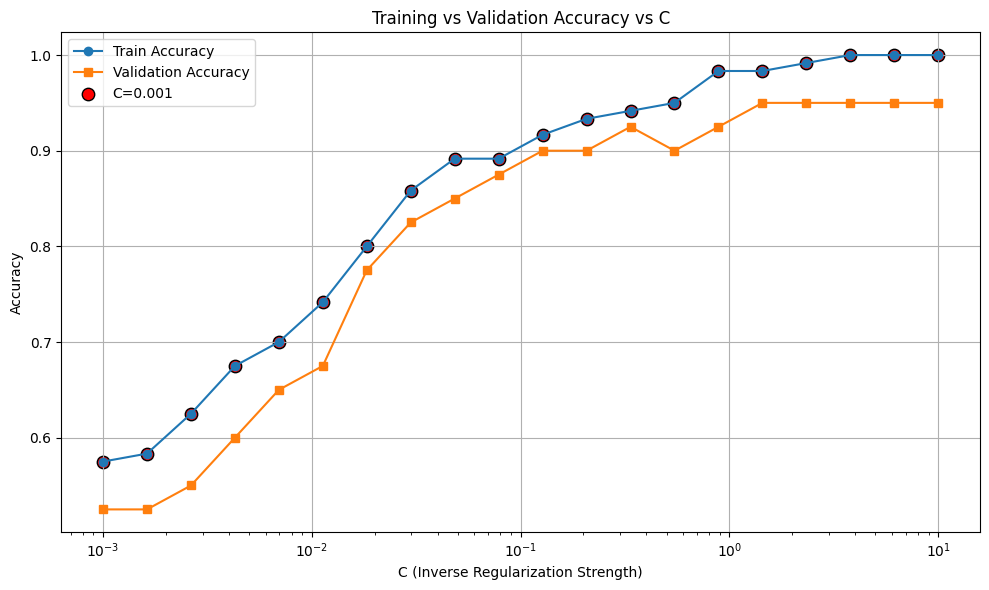
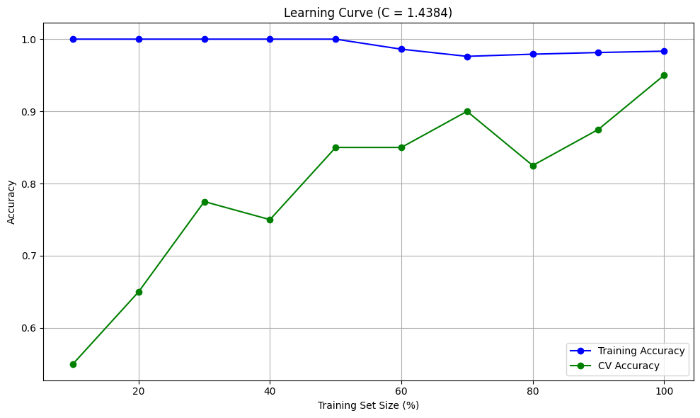
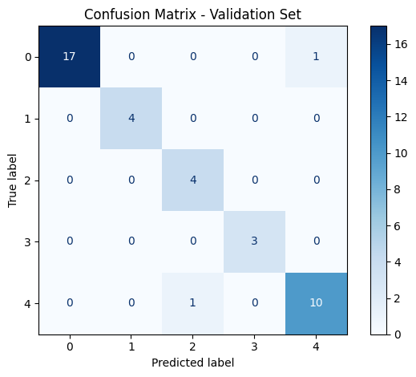
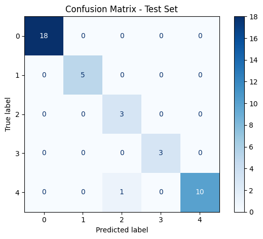

# 🧪 Drug Classification using Logistic Regression

This project presents a machine learning project that classifies drug types based on various patient features using Logistic Regression. The dataset used contains anonymized patient records with features such as Age, Sex, Blood Pressure, Cholesterol, and Na-to-K ratio.

## 🚀 Overview
- **Model Used**: Logistic Regression (Multi-class)
- **Dataset**: [`drug200.csv`](https://www.kaggle.com/datasets/prathamtripathi/drug-classification)
- **Classes**: 5 drug types (encoded 0 to 4)
- **Size**: 200 samples
- **Tech Stack**: Python, scikit-learn, matplotlib, seaborn, pandas

## 🧪 Modeling Process

1. Preprocessing (Label Encoding)
2. Stratified split → Train / CV / Test
3. Logistic Regression model training
4. Regularization tuning using parameter `C`
5. Evaluation using:
   - Accuracy
   - Confusion matrices
   - Classification reports

## 🖼️ Results
- Achieved **97% accuracy** on the test set
- Regularization successfully reduced overfitting
- Model generalizes well across all drug classes

## 📊 Visualizations
### 🔁 Regularization Curve
- Loop over multiple values of regularization parameter C
- Record training and CV scores
- Plot training and validation error vs C

### 📈 Learning Curve (Manual, Using Custom CV Set)
- Evaluates how model performance changes with increasing training size
- Uses a fixed cross-validation set (CV) for all evaluations
- Helps visualize underfitting vs overfitting behavior

### 📉 Confusion Matrix Heatmaps
**Train | CV | Test**

  
  
  

## 🧾 Classification Report (Test Set)
          precision    recall  f1-score   support
       0       1.00      1.00      1.00        18
       1       1.00      1.00      1.00         5
       2       0.75      1.00      0.86         3
       3       1.00      1.00      1.00         3
       4       1.00      0.91      0.95        11
       
       accuracy                           0.97        40

## 📌 Observations
- Achieved **97% accuracy** on the test set.
- Regularization parameter (`C`) tuned effectively to reduce overfitting.
- Confusion matrix reveals good performance on underrepresented classes.
- This project highlights how even a simple model can be powerful with proper tuning.

## 🛠️ Requirements
- python
- scikit-learn
- pandas
- numpy
- matplotlib
- seaborn

## 💡 Author
Talha Altaf
[My LinkedIn](https://www.linkedin.com/in/talhaaltaf/) | [My Github] (https://github.com/TalhaAltaf2914)

## 📝 License
MIT License
